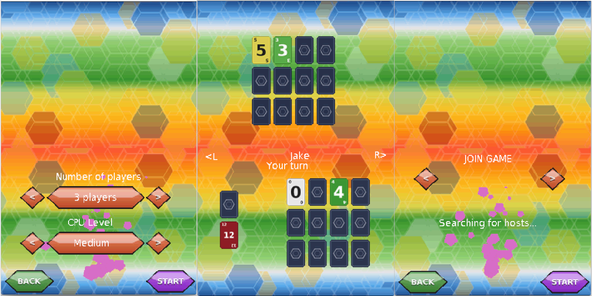

# Skyjo DS

A homebrew port of the card game **Skyjo** for the Nintendo DS / DSi.



## About

Skyjo is a card game for 2 or more players. Everyone starts with a face-down
grid of number cards (from -2 to 12) and, on their turn, draws a card to swap
into their grid or flips one of their hidden cards. A full matching column is
removed. When a player has revealed their whole grid the round ends, everyone
scores the sum of their cards, and — round after round — the player with the
**lowest total wins**.

This is an unofficial, from-scratch implementation for the Nintendo DS, with a
touch-driven interface, computer opponents, and local wireless play between
several consoles.

## Features

- **Single player vs. CPU** with three difficulty levels: Easy, Medium and Hard.
- **Local wireless multiplayer** over DS Wi-Fi — host a game or join a nearby host.
- Configurable **number of players** and CPU level from the setup screen.
- Full **touch-screen controls** and an animated hex-themed interface.
- **Music and sound effects** throughout the menus and gameplay.

## Play it

Grab `skyjo-nds.nds` and run it on:

- a **DS emulator** such as [melonDS](https://melonds.kuribo64.net/) or DeSmuME
  (use melonDS for local wireless multiplayer between instances), or
- a real **Nintendo DS / DSi** via a flashcart or homebrew loader.

## Building from source

The project builds with the [BlocksDS](https://blocksds.skylyrac.net/) toolchain
(install it first). Then, from the repository root:

```bash
./setup-env.sh              # create the Python env and install the build tooling
source env/bin/activate
python build.py             # produces skyjo-nds.nds
```

## Project layout

| Path | Contents |
| --- | --- |
| `source/` | Game code (C++): main loop, menus, game logic |
| `source/GamePartyClasses/` | Player/CPU controllers and card-game rules |
| `source/GamePartyClasses/CpuStrategies/` | Easy / Medium / Hard AI strategies |
| `source/Net/` | Local wireless (Wi-Fi) networking |
| `resources/` | Graphics, fonts, music and sound-effect assets |
| `build.py`, `Makefile` | Build scripts |

## Credits

- **Music** — Abstraction / Tallbeard Studios (*Music Loop Bundle*, CC0) —
  <https://tallbeard.itch.io/>
- **Sound effects** — JD Sherbert — <https://jdsherbert.itch.io/>
- Built with **BlocksDS**, **Nitro Engine Advanced**, and **maxmod**.

## License

The source code is released under the **Apache License 2.0** — see [LICENSE](LICENSE).

Skyjo is a trademark of Magilano. This is a fan-made, non-commercial homebrew
project and is not affiliated with or endorsed by Magilano.
